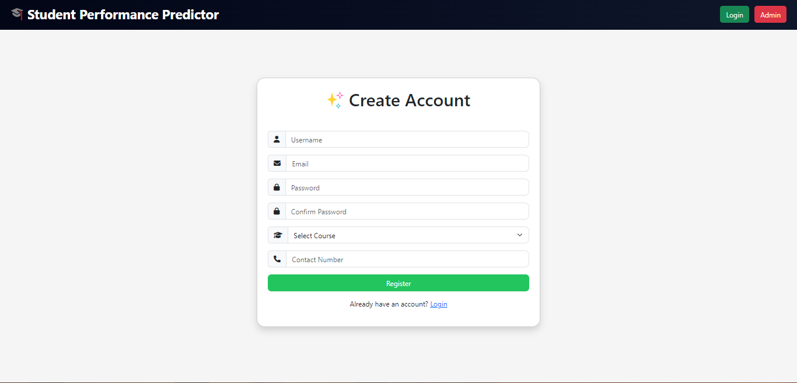
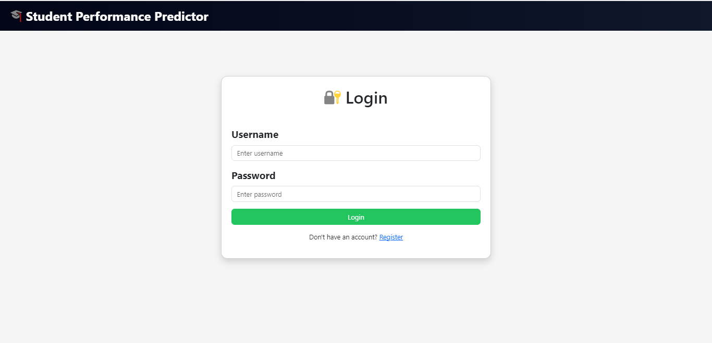
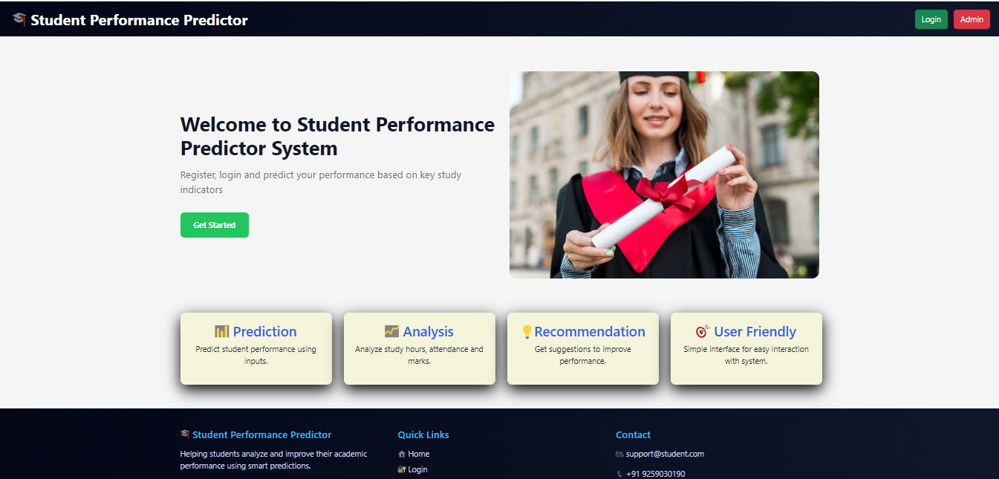
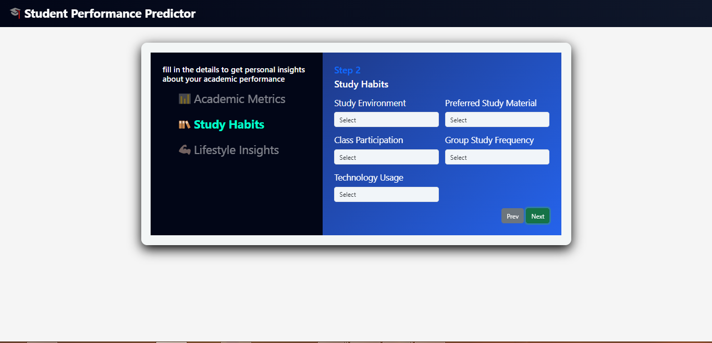
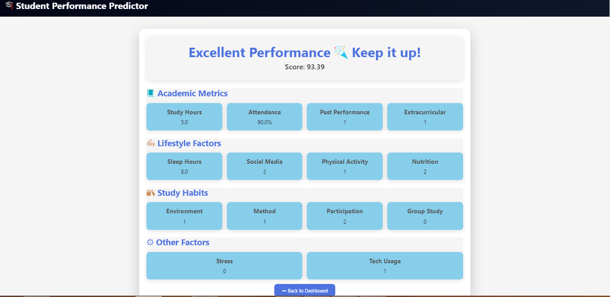
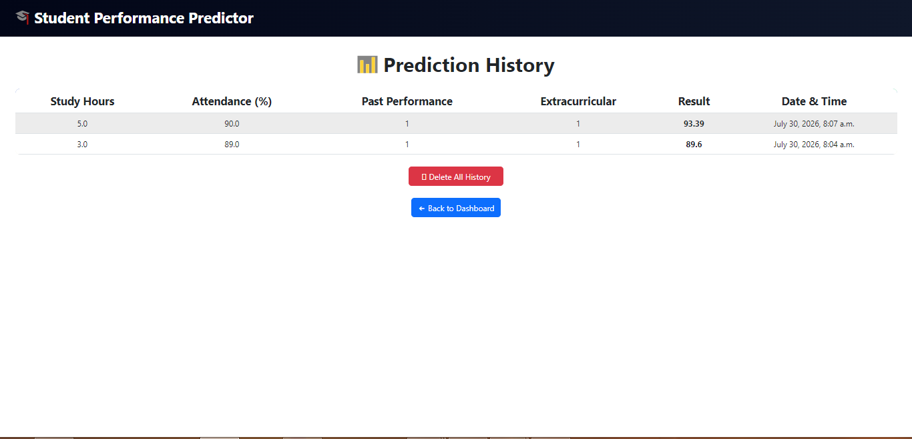
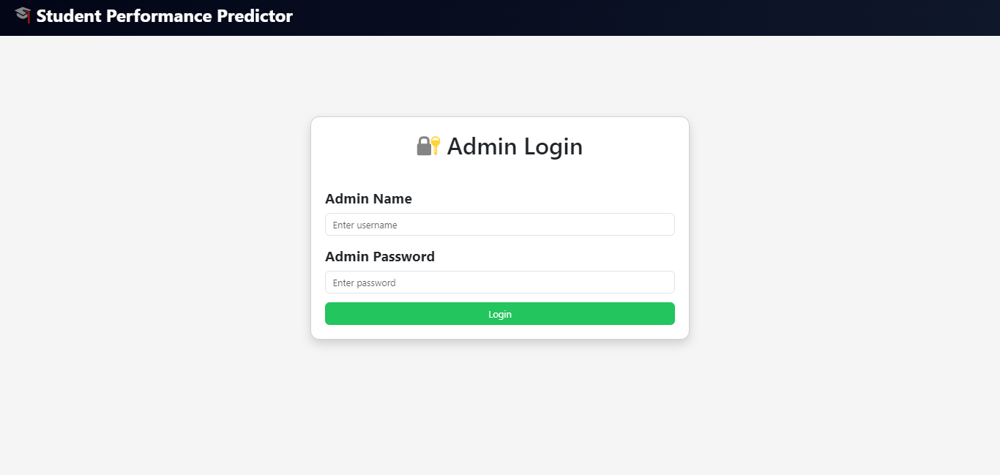
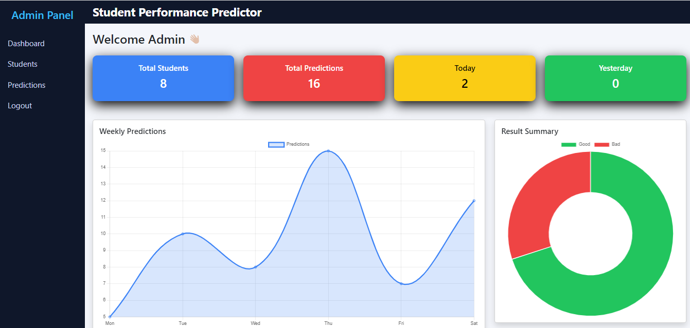
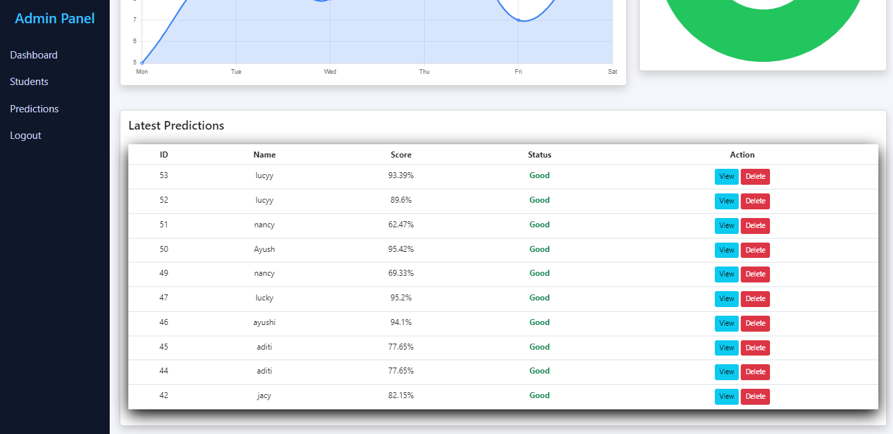

# Student Performance Predictor

A Machine Learning based web application that predicts student performance based on input data.

## Features

- User-friendly web interface
- Student performance prediction
- Machine Learning model integration
- Django based backend

## Technologies Used

- Python
- Django
- Machine Learning
- HTML
- CSS
- JavaScript
- SQLite

## Project Structure

- `student` - Django application
- `predictor` - Prediction related files
- `templates` - Frontend HTML files
- ## Screenshots

### Register Page

### Login Page

### Home Page

### Prediction Page

### Result Page

### history Page

### admin Page

### admin Page

### admin Page

- `train_model.py` - ML model training
- `manage.py` - Django project management

## How to Run the Project

1. Clone the repository
